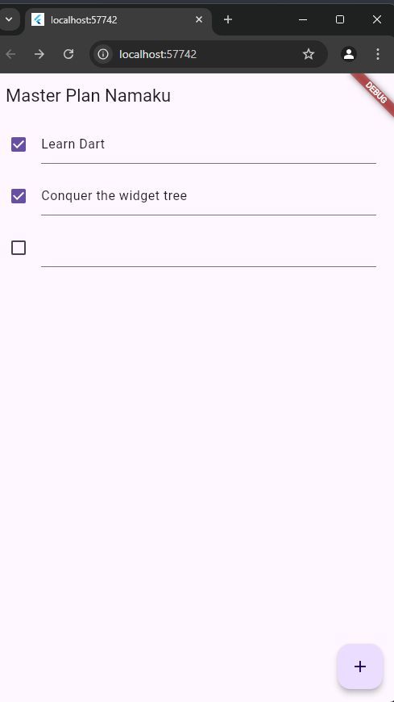
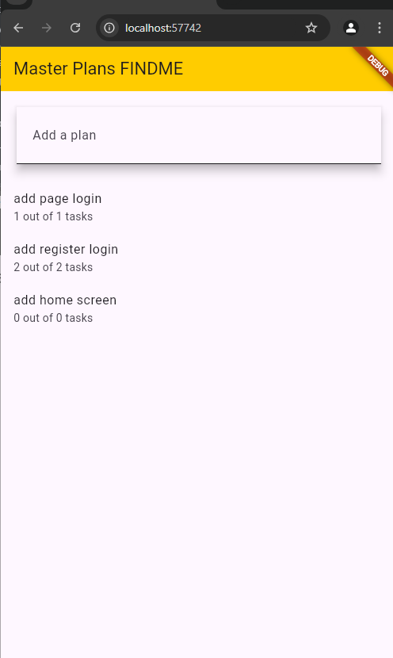

# flutter-fundamental

# Nama : Rizqi Reza Danuarta

# NIM : 2141720057

# Kelas: TI-3C

 

# Minggu Ke-10

# Tugas Praktikum 1: Dasar State dengan Model-View

1.  Selesaikan langkah-langkah praktikum tersebut, lalu dokumentasikan berupa GIF hasil akhir praktikum beserta penjelasannya di file README.md! Jika Anda menemukan ada yang error atau tidak berjalan dengan baik, silakan diperbaiki.
2.  Jelaskan maksud dari langkah 4 pada praktikum tersebut! Mengapa dilakukan demikian?

    answers :
    Langkah 4 pada praktikum tersebut mengarahkan Anda untuk membuat file plan.dart di dalam folder models dan mengisinya dengan kode untuk mendefinisikan kelas Plan. Berikut adalah penjelasan dan alasan di balik langkah ini:

    Membuat Struktur Data: Kelas Plan berfungsi sebagai model data yang menyimpan daftar tugas. Ini membantu memisahkan logika bisnis dari tampilan (UI), yang merupakan praktik terbaik dalam pengembangan aplikasi.
    Organisasi Kode: Dengan menempatkan model di folder models, kode menjadi lebih terorganisir dan mudah dikelola. Ini memudahkan pengembang untuk menemukan dan memperbarui bagian tertentu dari aplikasi.
    Pemeliharaan dan Skalabilitas: Memisahkan model dari tampilan memungkinkan aplikasi untuk lebih mudah dipelihara dan diskalakan. Perubahan pada logika data tidak akan mempengaruhi tampilan dan sebaliknya.

3.  Mengapa perlu variabel plan di langkah 6 pada praktikum tersebut? Mengapa dibuat konstanta ?

    answer :
    Variabel plan di langkah 6 pada praktikum tersebut berfungsi sebagai model data yang menyimpan daftar tugas. Berikut adalah alasan mengapa variabel ini diperlukan dan mengapa dibuat sebagai konstanta:

    Penyimpanan Data: plan digunakan untuk menyimpan dan mengelola data tugas yang akan ditampilkan di aplikasi. Ini memungkinkan aplikasi untuk menambah, mengubah, dan menghapus tugas sesuai kebutuhan pengguna.
    Pemeliharaan State: Dengan menggunakan variabel plan, aplikasi dapat dengan mudah melacak perubahan pada daftar tugas dan memperbarui tampilan UI secara dinamis ketika ada perubahan data.
    Konstanta untuk Immutabilitas: Membuat plan sebagai konstanta (const Plan()) memastikan bahwa instance awal dari Plan tidak dapat diubah. Ini membantu dalam menjaga integritas data dan mencegah perubahan yang tidak disengaja pada instance awal. Immutabilitas juga dapat meningkatkan performa aplikasi karena Flutter dapat mengoptimalkan rendering komponen yang tidak berubah.

4.  Lakukan capture hasil dari Langkah 9 berupa GIF, kemudian jelaskan apa yang telah Anda buat!

    answer :

    

5.  Apa kegunaan method pada Langkah 11 dan 13 dalam lifecyle state ?

        answer :
        initState(): Method ini digunakan untuk menginisialisasi state. Pada Langkah 11, initState() digunakan untuk menginisialisasi ScrollController yang akan mengatur perilaku scroll dan keyboard pada aplikasi.

    dispose(): Method ini digunakan untuk membersihkan resource ketika widget tidak lagi digunakan1. Pada Langkah 13, dispose() digunakan untuk membersihkan ScrollController agar tidak terjadi kebocoran memori.

Tugas Praktikum 2: 2: InheritedWidget

1. Selesaikan langkah-langkah praktikum tersebut, lalu dokumentasikan berupa GIF hasil akhir praktikum beserta penjelasannya di file README.md! Jika Anda menemukan ada yang error atau tidak berjalan dengan baik, silakan diperbaiki sesuai dengan tujuan aplikasi tersebut dibuat.
2. Jelaskan mana yang dimaksud InheritedWidget pada langkah 1 tersebut! Mengapa yang digunakan InheritedNotifier?

   answer :
   Pada langkah 1, yang dimaksud dengan InheritedWidget adalah sebuah widget yang memungkinkan data atau state untuk dibagikan ke seluruh widget tree tanpa harus melewati constructor dari setiap widgetInheritedWidget sangat berguna untuk mengelola state yang perlu diakses oleh banyak widget dalam aplikasi Flutter1.

   Namun, dalam kasus ini, digunakan InheritedNotifier sebagai gantinyaInheritedNotifier adalah varian dari InheritedWidget yang dirancang khusus untuk bekerja dengan objek Listenable, seperti ChangeNotifier atau ValueNotifier InheritedNotifier memungkinkan widget untuk mendengarkan perubahan pada objek Listenable dan memperbarui dirinya sendiri ketika ada perubahan

3. Jelaskan maksud dari method di langkah 3 pada praktikum tersebut! Mengapa dilakukan demikian?

   answer :

   Method initState() adalah bagian dari lifecycle widget di Flutter yang dipanggil sekali ketika stateful widget pertama kali dibuat. Ini adalah tempat yang tepat untuk melakukan inisialisasi yang hanya perlu dilakukan sekali, seperti mengatur controller, listener, atau memulai animasi.
   Alasan Penggunaan: Dalam konteks praktikum ini, initState() digunakan untuk menginisialisasi ScrollController dan menambahkan listener padanya. Listener ini akan memanggil FocusScope.of(context).requestFocus(FocusNode()) setiap kali ada perubahan pada posisi scroll. Ini berguna untuk menghilangkan fokus dari input field ketika pengguna menggulir daftar, sehingga keyboard akan disembunyikan secara otomatis.

4. Lakukan capture hasil dari Langkah 9 berupa GIF, kemudian jelaskan apa yang telah Anda buat!

   answer : hasilnya tetep sama tidak ada perubahan pada tampilan ui karena pada kode program diatas digunakan untuk memisah antara view dan model

   

# Tugas Praktikum 3: State di Multiple Screens

1. Selesaikan langkah-langkah praktikum tersebut, lalu dokumentasikan berupa GIF hasil akhir praktikum beserta penjelasannya di file README.md! Jika Anda menemukan ada yang error atau tidak berjalan dengan baik, silakan diperbaiki sesuai dengan tujuan aplikasi tersebut dibuat.
2. Berdasarkan Praktikum 3 yang telah Anda lakukan, jelaskan maksud dari gambar diagram berikut ini!
3. Lakukan capture hasil dari Langkah 14 berupa GIF, kemudian jelaskan apa yang telah Anda buat!
4. Kumpulkan laporan praktikum Anda berupa link commit atau repository GitHub ke spreadsheet yang telah disediakan!

hasil output dari Tugas Praktikum 3 :

