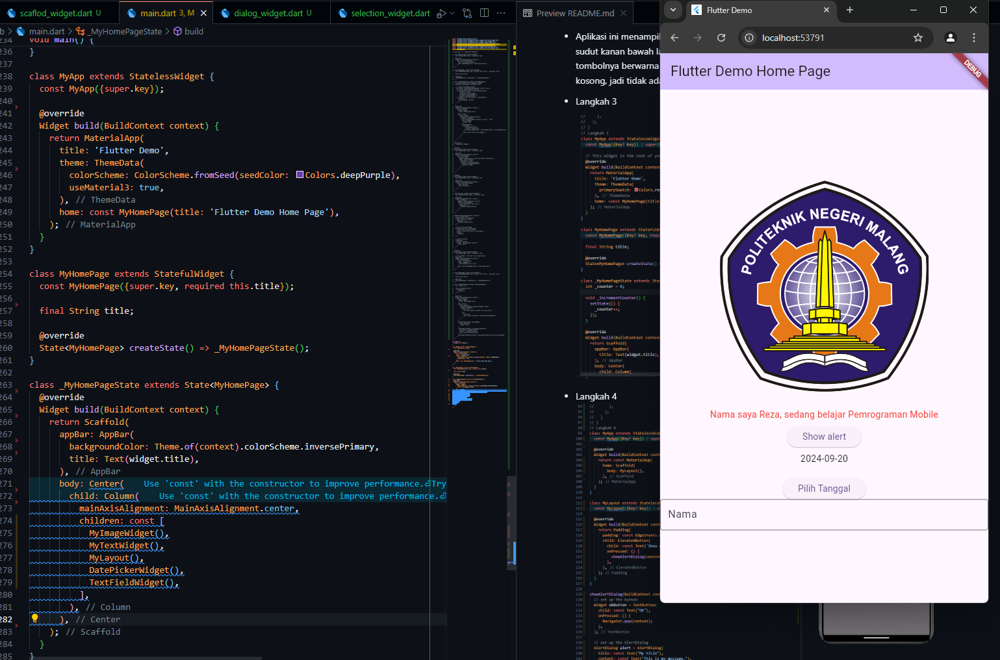

# flutter-fundamental

# Nama : Rizqi Reza Danuarta

# NIM : 2141720057

# Kelas: TI-3C

### Praktikum 2

- Langkah 12

  

### Praktikum 3

- Langkah 1

  

* Langkah 2

  

### Praktikum 1 dan 3 Final

    

### Praktikum 4

- Langkah 1

```dart
return MaterialApp(
      home: Container(
        margin: const EdgeInsets.only(top: 30),
        color: Colors.white,
        child: Column(
          children: <Widget>[
            CupertinoButton(
              child: const Text("Contoh button"),
              onPressed: () {},
            ),
            const CupertinoActivityIndicator(),
          ],
        ),
      ),
    );
```

penjelasan : Program ini membuat sebuah aplikasi sederhana yang menampilkan:

- Sebuah tombol dengan teks "Contoh button" menggunakan gaya tombol iOS.
  Sebuah indikator aktivitas (spinner) yang terus berputar, menandakan proses yang sedang berjalan.
- Tata letaknya adalah secara vertikal, dengan tombol di bagian atas dan indikator di bawahnya.

* Langkah 2

```dart
return MaterialApp(
      home: Scaffold(
        floatingActionButton: FloatingActionButton(
          onPressed: () {
            // Add your onPressed code here!
          },
          child: const Icon(Icons.thumb_up),
          backgroundColor: Colors.pink,
        ),
      ),
    );
```

penjelasan :

- Aplikasi ini menampilkan sebuah halaman dengan tombol FloatingActionButton yang melayang di sudut kanan bawah layar.
  Tombol ini memiliki ikon jempol (thumb up), dan latar belakang tombolnya berwarna pink.
  Ketika tombol ditekan, fungsi dalam onPressed akan dieksekusi (saat ini kosong, jadi tidak ada aksi).

- Langkah 3

  

- Langkah 4
  

- Langkah 5
  

- Langkah 6
  

### Tugas Praktikum


