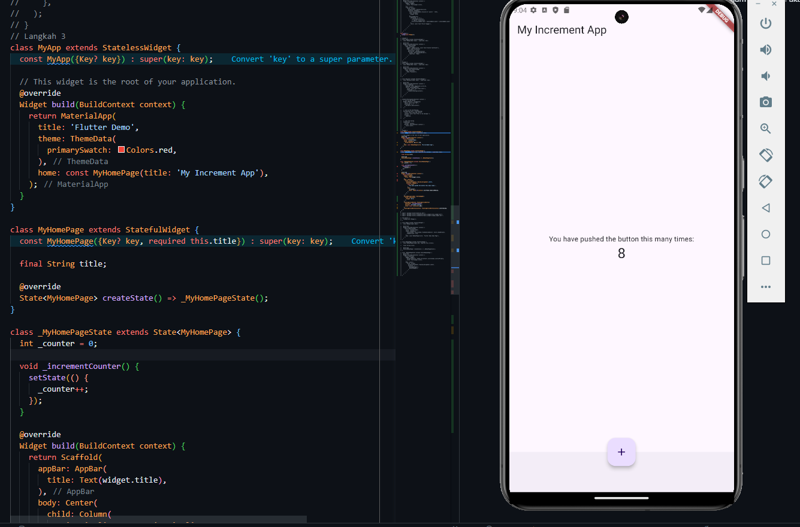

# flutter-fundamental

# Nama : Rizqi Reza Danuarta

# NIM : 2141720057

# Kelas: TI-3C

### MINGGU KE - 4

### Praktikum 2

- Langkah 12

  

### Praktikum 3

- Langkah 1

  

* Langkah 2

  

### Praktikum 1 dan 3 Final

    

### Praktikum 4

- Langkah 1

```dart
return MaterialApp(
      home: Container(
        margin: const EdgeInsets.only(top: 30),
        color: Colors.white,
        child: Column(
          children: <Widget>[
            CupertinoButton(
              child: const Text("Contoh button"),
              onPressed: () {},
            ),
            const CupertinoActivityIndicator(),
          ],
        ),
      ),
    );
```

penjelasan : Program ini membuat sebuah aplikasi sederhana yang menampilkan:

- Sebuah tombol dengan teks "Contoh button" menggunakan gaya tombol iOS.
  Sebuah indikator aktivitas (spinner) yang terus berputar, menandakan proses yang sedang berjalan.
- Tata letaknya adalah secara vertikal, dengan tombol di bagian atas dan indikator di bawahnya.

* Langkah 2

```dart
return MaterialApp(
      home: Scaffold(
        floatingActionButton: FloatingActionButton(
          onPressed: () {
            // Add your onPressed code here!
          },
          child: const Icon(Icons.thumb_up),
          backgroundColor: Colors.pink,
        ),
      ),
    );
```

penjelasan :

- Aplikasi ini menampilkan sebuah halaman dengan tombol FloatingActionButton yang melayang di sudut kanan bawah layar.
  Tombol ini memiliki ikon jempol (thumb up), dan latar belakang tombolnya berwarna pink.
  Ketika tombol ditekan, fungsi dalam onPressed akan dieksekusi (saat ini kosong, jadi tidak ada aksi).

- Langkah 3

  

- Langkah 4
  

- Langkah 5
  

- Langkah 6
  

### Tugas Praktikum


### MINGGU KE - 5

### Praktikum 1

### Langkah 2: Buka file lib/main.dart dan Langkah 4:Implementasi title row

```dart
// Langkah 2
import 'package:flutter/material.dart';

void main() => runApp(const MyApp());

class MyApp extends StatelessWidget {
  const MyApp({super.key});

  Widget titleSection() {
    return Container(
      padding: const EdgeInsets.all(32),
      child: Row(
        children: [
          Expanded(
            child: Column(
              crossAxisAlignment: CrossAxisAlignment.start,
              children: [
                Container(
                  padding: const EdgeInsets.only(bottom: 8),
                  child: const Text(
                    'Wisata Gunung di Pulau Lombok, Nusa Tenggara Barat',
                    style: TextStyle(
                      fontWeight: FontWeight.bold,
                    ),
                  ),
                ),
                const Text(
                  'Pulau Lombok, Nusa Tenggara Barat',
                  style: TextStyle(
                    color: Colors.grey,
                  ),
                ),
              ],
            ),
          ),
          const Icon(
            Icons.star,
            color: Colors.red,
          ),
          const Text('41'),
        ],
      ),
    );
  }
```

penjelasan :

      Kode di atas adalah bagian dari aplikasi Flutter yang mendefinisikan tampilan antarmuka pengguna menggunakan widget. Dimulai dengan fungsi utama main, kode ini menjalankan aplikasi dengan memanggil widget MyApp, yang merupakan StatelessWidget. Di dalam MyApp, terdapat fungsi titleSection yang bertanggung jawab untuk membuat bagian judul tampilan. Bagian ini menggunakan Container untuk memberikan padding, dan di dalamnya terdapat Row yang berisi kolom dan ikon. Kolom ini memuat dua teks: satu untuk judul yang ditampilkan dalam gaya tebal dan satu lagi untuk lokasi yang ditampilkan dalam warna abu-abu. Selain itu, terdapat ikon bintang merah dan teks yang menunjukkan jumlah bintang (41). Kode ini secara efektif menggunakan widget standar Flutter seperti Container, Row, Column, Text, dan Icon untuk menyusun elemen-elemen tampilan, sehingga menciptakan antarmuka yang informatif mengenai objek wisata di Pulau Lombok, lengkap dengan judul, lokasi, dan rating bintang.

### Praktikum 2

```dart
 @override
  Widget build(BuildContext context) {
    // Praktikum 2
    // Lngkah 2
    Color color = Theme.of(context).primaryColor;
    Widget buttonSection = Row(
      mainAxisAlignment: MainAxisAlignment.spaceEvenly,
      children: [
        _buildButtonColumn(color, Icons.call, 'Call'),
        _buildButtonColumn(color, Icons.near_me, 'Route'),
        _buildButtonColumn(color, Icons.share, 'Share'),
      ],
    );

    return MaterialApp(
      title: 'Flutter layout: Rizqi Reza Danuarta dan 2241720057',
      home: Scaffold(
        appBar: AppBar(
          title: const Text('Flutter layout demo'),
        ),
        body: Center(
          child: ListView(
            children: [
              Image.asset(
                'lib/image/rinjani.jpeg',
                width: 600,
                height: 240,
                fit: BoxFit.cover,
              ),
              titleSection(),
              buttonSection,
              textSection,
              const Center(
                child: Text('Rizqi Reza Danuarta'),
              ),
            ],
          ),
        ),
      ),
    );
  }

  // praktikum 2
  // langkah 1
  Column _buildButtonColumn(Color color, IconData icon, String label) {
    return Column(
      mainAxisSize: MainAxisSize.min,
      mainAxisAlignment: MainAxisAlignment.center,
      children: [
        Icon(icon, color: color),
        Container(
          margin: const EdgeInsets.only(top: 8),
          child: Text(
            label,
            style: TextStyle(
              fontSize: 12,
              fontWeight: FontWeight.w400,
              color: color,
            ),
          ),
        ),
      ],
    );
  }
```

penjelasan :

    Kode di atas merupakan lanjutan dari aplikasi Flutter yang mendefinisikan tampilan antarmuka pengguna dengan menambahkan beberapa elemen interaktif. Dalam metode build, aplikasi memanfaatkan tema warna utama yang ditentukan dalam konteks untuk mendesain tombol. Terdapat bagian buttonSection yang diatur dalam Row dengan menggunakan MainAxisAlignment.spaceEvenly, berisi tiga tombol: "Call," "Route," dan "Share," yang dibangun dengan fungsi _buildButtonColumn. Setiap tombol terdiri dari ikon dan label yang sesuai, semuanya menggunakan warna utama aplikasi. Di dalam widget MaterialApp, terdapat struktur Scaffold yang mencakup AppBar dan body, di mana body terdiri dari ListView untuk menampilkan gambar dari aset lokal, bagian judul, tombol, dan teks lainnya

### Praktikum 3

```dart
// Praktikum 3
    // langkah 1
    Widget textSection = Container(
      padding: const EdgeInsets.all(32),
      child: const Text(
        'Gunung Rinjani adalah gunung yang berlokasi di Pulau Lombok, Nusa Tenggara Barat. '
        'Gunung yang merupakan gunung berapi kedua tertinggi di Indonesia dengan ketinggian 3.726 mdpl '
        'serta terletak pada lintang 8º25 LS dan 116º28 BT ini merupakan gunung favorit bagi pendaki Indonesia '
        'karena keindahan pemandangannya.\n\n'
        'Gunung ini merupakan bagian dari Taman Nasional Gunung Rinjani '
        'yang memiliki luas sekitar 41.330 ha dan diusulkan penambahannya sehingga menjadi 76.000 ha ke arah barat dan timur.',
        softWrap: true,
      ),
    );
```

penjelasan :

    Kode di atas mendefinisikan bagian teks dalam aplikasi Flutter yang menjelaskan tentang Gunung Rinjani. Menggunakan widget Container, bagian ini diberikan padding untuk memberikan ruang di sekeliling teks, sehingga lebih mudah dibaca. Teks yang ditampilkan memberikan informasi detail tentang Gunung Rinjani

### Praktikum 4

```dart
body: Center(
          child: ListView(
            children: [
              Image.asset(
                'lib/image/rinjani.jpeg',
                width: 600,
                height: 240,
                fit: BoxFit.cover,
              ),
              titleSection(),
              buttonSection,
              textSection,
              const Center(
                child: Text('Rizqi Reza Danuarta'),
              ),
            ],
          ),
        ),
```

penjelasan :

    Image.asset untuk menampilkan gambar dari file aset yang telah didefinisikan dalam file pubspec.yaml. Gambar yang ditampilkan adalah rinjani.jpeg, yang memiliki lebar 600 piksel dan tinggi 240 piksel, dengan pengaturan BoxFit.cover untuk memastikan bahwa gambar akan mengisi ruang yang tersedia dengan menjaga proporsinya. Penempatan gambar ini berada di dalam widget ListView, yang memungkinkan pengguna untuk menggulir melalui konten jika diperlukan. Selain itu, terdapat juga definisi aset gambar dalam bagian assets dari file pubspec.yaml, yang mencantumkan dua gambar: logo_polinema.png dan rinjani.jpeg.

## Praktikum 5 : Membangun Navigasidi Flutter

### Langkah 1 : Siapkan Project Baru


### Langkah 2 : Mendefinisikan Route

- Home Page

```dart
import 'package:flutter/material.dart';

class HomePage extends StatelessWidget {
  @override
  Widget build(BuildContext context) {
    throw UnimplementedError();
  }
}
```

- Item Page

```dart
import 'package:flutter/material.dart';

class ItemPage extends StatelessWidget {
  @override
  Widget build(BuildContext context) {
    throw UnimplementedError();
  }
}
```

### Langkah 3 : Lengkapi kode di Main.dart

```dart
initialRoute: '/',
routes: {
    '/': (context) => HomePage(),
    '/home': (context) => ItemPage(),
},
```

### Langkah 4 : Membuat Data Model

```dart
class Item {
  String name;
  int price;

  Item({required this.name, required this.price});
}
```

### Langkah 5 : Lengkapi kode di Home Page

```dart
final List<Item> items = [
    Item(name: 'Sugar', price: 5000),
    Item(name: 'Salt', price: 2000),
];
```

### Langkah 6 : Membuat ListView dan ItemBuilder

```dart
    return Scaffold(
      body: Container(
        margin: EdgeInsets.all(8),
        child: ListView.builder(
          padding: EdgeInsets.all(8),
            itemCount: items.length,
            itemBuilder: (context, index) {
              final item = items[index];
              return Card(
                child: Container(
                  margin: EdgeInsets.all(8),
                  child: Row(
                    children: [
                      Expanded(child: Text(item.name)),
                      Expanded(
                          child: Text(
                            item.price.toString(),
                            textAlign: TextAlign.end,
                          ),
                      ),
                    ],
                  ),
                )
              );
            }
        ),
      ),
    );
```

### Langkah 7 : Menambahkan aksi pada ListView

```dart
            return InkWell(
                onTap: () {
                  Navigator.pushNamed(context, '/item');
                },
                child: Card(
                  child: Container(
                    margin: EdgeInsets.all(8),
                    child: Row(
                      children: [
                        Expanded(child: Text(item.name)),
                        Expanded(
                            child: Text(
                              item.price.toString(),
                              textAlign: TextAlign.end,
                            ),
                        ),
                      ],
                    ),
                  )
                ),
              );
```

### Hasil Output


## Tugas 2

1. Untuk melakukan pengiriman data ke halaman berikutnya, cukup menambahkan informasi arguments pada penggunaan Navigator. Perbarui kode pada bagian Navigator menjadi seperti berikut.

```dart
itemBuilder: (context, index) {
          final currentItem = items[index];
          return InkWell(
            onTap: () {
              Navigator.pushNamed(
                context,
                '/item',
                arguments: currentItem,
              );
            },
```

2. Pembacaan nilai yang dikirimkan pada halaman sebelumnya dapat dilakukan menggunakan ModalRoute. Tambahkan kode berikut pada blok fungsi build dalam halaman ItemPage. Setelah nilai didapatkan, anda dapat menggunakannya seperti penggunaan variabel pada umumnya

```dart
import 'package:flutter/material.dart';
import 'package:flutter_fundamental/models/item.dart';

class ItemPage extends StatelessWidget {
  @override
  Widget build(BuildContext context) {
    final itemArgs = ModalRoute.of(context)!.settings.arguments as Item;

    return Scaffold(
      appBar: AppBar(
        title: Text(itemArgs.name),
      ),
      body: Padding(
        padding: const EdgeInsets.all(16.0),
        child: Column(
          crossAxisAlignment: CrossAxisAlignment.start,
          children: [
            // Menampilkan foto produk
            Image.network(
              itemArgs.imageUrl,
              width: double.infinity,
              height: 200,
              fit: BoxFit.cover,
            ),
            SizedBox(height: 16),
            Text(
              'Price: \$${itemArgs.price}',
              style: TextStyle(fontSize: 24, fontWeight: FontWeight.bold),
            ),
            SizedBox(height: 8),
            Text(
              'Stock: ${itemArgs.stock}',
              style: TextStyle(fontSize: 18),
            ),
            SizedBox(height: 8),
            Row(
              children: [
                Icon(Icons.star, color: Colors.orange, size: 24),
                SizedBox(width: 8),
                Text(
                  '${itemArgs.rating}',
                  style: TextStyle(fontSize: 18),
                ),
              ],
            ),
          ],
        ),
      ),
    );
  }
}

```

3. Pada hasil akhir dari aplikasi belanja yang telah anda selesaikan, tambahkan atribut foto produk, stok, dan rating. Ubahlah tampilan menjadi GridView seperti di aplikasi marketplace pada umumnya.

```dart
import 'package:flutter/material.dart';
import 'package:flutter_fundamental/models/item.dart';

class HomePage extends StatelessWidget {
  final List<Item> items = [
    Item(
      name: 'Sugar',
      price: 5000,
      imageUrl:
          'https://th.bing.com/th/id/R.96c0be17b21250bc6033afed036b25b4?rik=czat0cEFPb7v7Q&riu=http%3a%2f%2fwww.visitcompletecare.com%2fwp-content%2fuploads%2f2020%2f11%2fshutterstock_1564269901-scaled.jpg&ehk=%2bJEboIJEbwUOxKRj%2b5wBwiOj5DE%2fq3vrKSG7tlbdm%2fk%3d&risl=&pid=ImgRaw&r=0',
      stock: 50,
      rating: 4.5,
    ),
    Item(
      name: 'Salt',
      price: 1000,
      imageUrl:
          'https://th.bing.com/th/id/OIP.-RKKKM-8vZ6yHj-D11MNcQHaE8?rs=1&pid=ImgDetMain',
      stock: 100,
      rating: 4.0,
    ),
  ];

  @override
  Widget build(BuildContext context) {
    return Scaffold(
      appBar: AppBar(
        title: Text('Supermarket Online'),
      ),
      body: GridView.builder(
        padding: EdgeInsets.all(8),
        gridDelegate: SliverGridDelegateWithFixedCrossAxisCount(
          crossAxisCount: 2,
          crossAxisSpacing: 8,
          mainAxisSpacing: 8,
          childAspectRatio: 2 / 3,
        ),
        itemCount: items.length,
        itemBuilder: (context, index) {
          final currentItem = items[index];
          return InkWell(
            onTap: () {
              Navigator.pushNamed(
                context,
                '/item',
                arguments: currentItem,
              );
            },
            child: Card(
              child: Column(
                crossAxisAlignment: CrossAxisAlignment.start,
                children: [
                  Expanded(
                    child: Image.network(
                      currentItem.imageUrl,
                      fit: BoxFit.cover,
                      width: double.infinity,
                    ),
                  ),
                  Padding(
                    padding: const EdgeInsets.all(8.0),
                    child: Column(
                      crossAxisAlignment: CrossAxisAlignment.start,
                      children: [
                        Text(
                          currentItem.name,
                          style: TextStyle(
                            fontSize: 16,
                            fontWeight: FontWeight.bold,
                          ),
                        ),
                        SizedBox(height: 4),
                        Text(
                          'Harga: Rp.${currentItem.price}',
                          style: TextStyle(fontSize: 14),
                        ),
                        SizedBox(height: 4),
                        Text(
                          'Stok: ${currentItem.stock}',
                          style: TextStyle(fontSize: 12, color: Colors.grey),
                        ),
                        SizedBox(height: 4),
                        Row(
                          children: [
                            Icon(Icons.star, color: Colors.orange, size: 16),
                            SizedBox(width: 4),
                            Text('${currentItem.rating}',
                                style: TextStyle(fontSize: 12)),
                          ],
                        ),
                      ],
                    ),
                  ),
                ],
              ),
            ),
          );
        },
      ),
    );
  }
}
```

hasil output seperti berikut ini


dan jika gambar di klik maka akan seperti ini


3. Silakan implementasikan Hero widget pada aplikasi belanja

- home page

```dart
Expanded(
                    child: Hero(
                      tag: currentItem.name,
                      child: Image.network(
                        currentItem.imageUrl,
                        fit: BoxFit.cover,
                        width: double.infinity,
                      ),
                    ),
                  ),
```

- item page

```dart
Hero(
              tag: itemArgs.name,
              child: Image.network(
                itemArgs.imageUrl,
                width: double.infinity,
                height: 200,
                fit: BoxFit.cover,
              ),
            ),
```

5. Sesuaikan dan modifikasi tampilan sehingga menjadi aplikasi yang menarik. Selain itu, pecah widget menjadi kode yang lebih kecil. Tambahkan Nama dan NIM di footer aplikasi belanja Anda.

disini saya menambahkan file widget untuk footer

```dart
import 'package:flutter/material.dart';

class Footer extends StatelessWidget {
  final String name;
  final String nim;

  const Footer({Key? key, required this.name, required this.nim})
      : super(key: key);

  @override
  Widget build(BuildContext context) {
    return Container(
      color: Colors.blue,
      padding: EdgeInsets.all(16.0),
      child: Center(
        child: Text(
          '$name | $nim',
          style: TextStyle(color: Colors.white, fontSize: 14),
        ),
      ),
    );
  }
}
```

lalu saya panggil pada home page

```dart
import 'package:flutter/material.dart';
import 'package:flutter_fundamental/models/item.dart';
import 'package:flutter_fundamental/widgets/footer.dart';
import 'package:flutter_fundamental/widgets/item_card.dart';
import 'package:flutter_fundamental/pages/item_page.dart';

class HomePage extends StatelessWidget {
  final List<Item> items = [
    Item(
      name: 'Sugar',
      price: 5000,
      imageUrl:
          'https://th.bing.com/th/id/R.96c0be17b21250bc6033afed036b25b4?rik=czat0cEFPb7v7Q&riu=http%3a%2f%2fwww.visitcompletecare.com%2fwp-content%2fuploads%2f2020%2f11%2fshutterstock_1564269901-scaled.jpg&ehk=%2bJEboIJEbwUOxKRj%2b5wBwiOj5DE%2fq3vrKSG7tlbdm%2fk%3d&risl=&pid=ImgRaw&r=0',
      stock: 50,
      rating: 4.5,
    ),
    Item(
      name: 'Salt',
      price: 1000,
      imageUrl:
          'https://th.bing.com/th/id/OIP.-RKKKM-8vZ6yHj-D11MNcQHaE8?rs=1&pid=ImgDetMain',
      stock: 100,
      rating: 4.0,
    ),
  ];

  @override
  Widget build(BuildContext context) {
    return Scaffold(
      appBar: AppBar(
        title: Text('Supermarket Online'),
        backgroundColor: Colors.blue,
      ),
      body: Column(
        children: [
          Expanded(
            child: GridView.builder(
              padding: EdgeInsets.all(8),
              gridDelegate: SliverGridDelegateWithFixedCrossAxisCount(
                crossAxisCount: 2,
                crossAxisSpacing: 8,
                mainAxisSpacing: 8,
                childAspectRatio: 2 / 3,
              ),
              itemCount: items.length,
              itemBuilder: (context, index) {
                final currentItem = items[index];
                return ItemCard(item: currentItem);
              },
            ),
          ),
          Footer(name: 'Rizqi Reza Danuarta', nim: '2241720057'),
        ],
      ),
    );
  }
}
```

hasil seperti berikut ini


6. Selesaikan Praktikum 5: Navigasi dan Rute tersebut. Cobalah modifikasi menggunakan plugin go_router, lalu dokumentasikan dan push ke repository Anda berupa screenshot setiap hasil pekerjaan beserta penjelasannya di file README.md. Kumpulkan link commit repository GitHub Anda kepada dosen yang telah disepakati!

- main

```dart
final GoRouter _router = GoRouter(
      routes: [
        GoRoute(
          path: '/',
          builder: (context, state) => HomePage(),
        ),
        GoRoute(
          path: '/item',
          builder: (context, state) {
            final item = state.extra as Item;
            return ItemPage(item: item);
          },
        ),
      ],
    );
```

- home page

```dart
class HomePage extends StatelessWidget {
  final List<Item> items = [
    Item(
      name: 'Sugar',
      price: 5000,
      imageUrl:
          'https://th.bing.com/th/id/R.96c0be17b21250bc6033afed036b25b4?rik=czat0cEFPb7v7Q&riu=http%3a%2f%2fwww.visitcompletecare.com%2fwp-content%2fuploads%2f2020%2f11%2fshutterstock_1564269901-scaled.jpg&ehk=%2bJEboIJEbwUOxKRj%2b5wBwiOj5DE%2fq3vrKSG7tlbdm%2fk%3d&risl=&pid=ImgRaw&r=0',
      stock: 50,
      rating: 4.5,
    ),
    Item(
      name: 'Salt',
      price: 1000,
      imageUrl:
          'https://th.bing.com/th/id/OIP.-RKKKM-8vZ6yHj-D11MNcQHaE8?rs=1&pid=ImgDetMain',
      stock: 100,
      rating: 4.0,
    ),
  ];

  @override
  Widget build(BuildContext context) {
    return Scaffold(
      appBar: AppBar(
        title: Text('Supermarket Online'),
        backgroundColor: Colors.blue,
      ),
      body: Column(
        children: [
          Expanded(
            child: GridView.builder(
              padding: const EdgeInsets.all(8),
              gridDelegate: const SliverGridDelegateWithFixedCrossAxisCount(
                crossAxisCount: 2,
                crossAxisSpacing: 8,
                mainAxisSpacing: 8,
                childAspectRatio: 2 / 3,
              ),
              itemCount: items.length,
              itemBuilder: (context, index) {
                final currentItem = items[index];
                return GestureDetector(
                  onTap: () {
                    // Navigasi ke halaman item dengan 'extra' berisi data item
                    context.push('/item', extra: currentItem);
                  },
                  child: ItemCard(item: currentItem),
                );
              },
            ),
          ),
          const Footer(name: 'Your Name', nim: 'Your NIM'),
        ],
      ),
    );
  }
}
```

- item page

```dart
class ItemPage extends StatelessWidget {
  final Item item;

  const ItemPage({Key? key, required this.item}) : super(key: key);

  @override
  Widget build(BuildContext context) {
    return Scaffold(
      appBar: AppBar(
        title: Text(item.name),
        backgroundColor: Colors.blue,
      ),
      body: Padding(
        padding: const EdgeInsets.all(16.0),
        child: Column(
          crossAxisAlignment: CrossAxisAlignment.start,
          children: [
            Hero(
              tag: item.name,
              child: Image.network(
                item.imageUrl,
                width: double.infinity,
                height: 200,
                fit: BoxFit.cover,
              ),
            ),
            const SizedBox(height: 16),
            Text(
              'Price: Rp.${item.price}',
              style: const TextStyle(fontSize: 24, fontWeight: FontWeight.bold),
            ),
            const SizedBox(height: 8),
            Text(
              'Stock: ${item.stock}',
              style: const TextStyle(fontSize: 18),
            ),
            const SizedBox(height: 8),
            Row(
              children: [
                const Icon(Icons.star, color: Colors.orange, size: 24),
                const SizedBox(width: 8),
                Text(
                  '${item.rating}',
                  style: const TextStyle(fontSize: 18),
                ),
              ],
            ),
          ],
        ),
      ),
    );
  }
}
```
